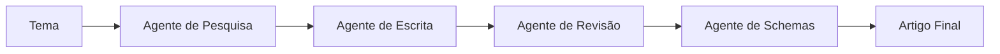

# 🏥 Sistema de Sub-Agentes para Artigos de Planos de Saúde

Sistema automatizado de criação de artigos sobre planos de saúde usando múltiplos agentes especializados com Claude AI.

## 📋 Visão Geral

Este projeto implementa um workflow completo com 4 agentes especializados que trabalham em sequência para criar artigos profissionais sobre planos de saúde:

1. **🔍 Agente de Pesquisa** - Realiza pesquisa profunda sobre o tema
2. **✍️ Agente de Escrita** - Produz o artigo em HTML otimizado
3. **📝 Agente de Revisão** - Revisa e melhora o conteúdo
4. **🏗️ Agente de Schemas** - Cria schemas JSON-LD para SEO

## 🚀 Instalação

### Pré-requisitos

- Node.js 18+
- npm ou yarn
- Chave de API da Anthropic

### Configuração

1. Clone o repositório:
```bash
git clone <seu-repositorio>
cd sub-agentes
```

2. Instale as dependências:
```bash
npm install
```

3. Configure as variáveis de ambiente:
```bash
cp .env.example .env
```

4. Edite o arquivo `.env` e adicione sua chave da API:
```env
ANTHROPIC_API_KEY=sua_chave_aqui
MODEL=claude-sonnet-4-5-20250929
OUTPUT_DIR=./output
```

5. Compile o projeto:
```bash
npm run build
```

## 💻 Uso

### Modo Rápido

Execute o workflow com um tema:

```bash
npm run workflow "Cobertura de telemedicina em planos de saúde"
```

### Modo Desenvolvimento

Para desenvolvimento com hot-reload:

```bash
npm run dev
```

### Uso Programático

```typescript
import { ArticleWorkflow } from './src/workflow.js';

const workflow = new ArticleWorkflow();
await workflow.execute('Seu tema aqui');
```

## 🎯 Estrutura do Projeto

```
sub-agentes/
├── src/
│   ├── agents/              # Implementação dos agentes
│   │   ├── BaseAgent.ts     # Classe base para todos os agentes
│   │   ├── ResearchAgent.ts # Agente de pesquisa
│   │   ├── WriterAgent.ts   # Agente de escrita
│   │   ├── ReviewerAgent.ts # Agente de revisão
│   │   ├── SchemaAgent.ts   # Agente de schemas
│   │   └── index.ts         # Exportações
│   ├── config/              # Configurações
│   │   └── prompts.ts       # Prompts personalizáveis dos agentes
│   ├── types/               # Definições de tipos TypeScript
│   │   └── index.ts
│   ├── utils/               # Funções auxiliares
│   │   └── helpers.ts
│   ├── workflow.ts          # Orquestrador principal
│   └── index.ts             # Ponto de entrada
├── output/                  # Artigos gerados (criado automaticamente)
├── .env                     # Variáveis de ambiente (não commitado)
├── .env.example             # Exemplo de configuração
├── package.json
├── tsconfig.json
└── README.md
```

## 🔧 Personalização dos Prompts

Os prompts de cada agente estão em `src/config/prompts.ts`. Você pode personalizá-los de acordo com suas necessidades:

### Exemplo: Customizar o Agente de Pesquisa

Edite `src/config/prompts.ts`:

```typescript
export const RESEARCH_AGENT_CONFIG: AgentConfig = {
  name: 'Agente de Pesquisa',
  description: 'Realiza pesquisa profunda sobre temas de planos de saúde',
  systemPrompt: `
    SEU PROMPT CUSTOMIZADO AQUI

    Instruções específicas...
    Formato de saída...
  `,
  maxTokens: 4096
};
```

### Agentes Disponíveis para Customização

1. **RESEARCH_AGENT_CONFIG** - Pesquisa profunda
2. **WRITER_AGENT_CONFIG** - Produção de artigo HTML
3. **REVIEWER_AGENT_CONFIG** - Revisão e melhorias
4. **SCHEMA_AGENT_CONFIG** - Geração de schemas SEO

## 📊 Fluxo de Trabalho



### Detalhamento das Etapas

#### 1️⃣ Pesquisa Profunda
- Analisa o tema de múltiplos ângulos
- Identifica pontos-chave
- Lista fontes e referências
- **Saída**: `1-research.json`

#### 2️⃣ Produção do Artigo
- Cria HTML semântico e otimizado
- Estrutura conteúdo de forma lógica
- Otimiza para SEO
- **Saída**: `2-article.html`, `2-article-metadata.json`

#### 3️⃣ Revisão
- Avalia precisão técnica
- Verifica clareza e gramática
- Sugere melhorias
- Pode criar versão revisada
- **Saída**: `3-review.json`, `3-article-revised.html` (opcional)

#### 4️⃣ Schemas
- Cria schemas JSON-LD
- Otimiza para Rich Snippets
- Segue padrões Schema.org
- **Saída**: `4-schemas.json`, `article-final.html`

## 📁 Arquivos Gerados

Cada execução cria uma pasta timestamped em `output/` com:

- `1-research.json` - Resultado da pesquisa
- `2-article.html` - Artigo original em HTML
- `2-article-metadata.json` - Metadados do artigo
- `3-review.json` - Análise e sugestões da revisão
- `3-article-revised.html` - Versão revisada (se aplicável)
- `4-schemas.json` - Schemas JSON-LD gerados
- `article-final.html` - Artigo final com schemas integrados
- `workflow-context.json` - Contexto completo do workflow

## 🎨 Exemplos de Uso

### Exemplo 1: Artigo sobre Carências

```bash
npm run workflow "Períodos de carência em planos de saúde individuais"
```

### Exemplo 2: Artigo sobre Coberturas

```bash
npm run workflow "Cobertura de tratamentos oncológicos pela ANS"
```

### Exemplo 3: Artigo sobre Regulamentação

```bash
npm run workflow "Mudanças na regulamentação de planos odontológicos em 2025"
```

## 🔌 API de Uso Programático

### Usando o Workflow Completo

```typescript
import { ArticleWorkflow } from './src/workflow.js';

const workflow = new ArticleWorkflow();
const result = await workflow.execute('Seu tema aqui');
```

### Usando Agentes Individualmente

```typescript
import { ResearchAgent, WriterAgent } from './src/agents/index.js';

// Apenas pesquisa
const researchAgent = new ResearchAgent(apiKey);
const research = await researchAgent.execute('Tema da pesquisa');

// Apenas escrita (requer resultado da pesquisa)
const writerAgent = new WriterAgent(apiKey);
const article = await writerAgent.execute(research.data);
```

## ⚙️ Configurações Avançadas

### Alterar o Modelo da IA

No arquivo `.env`:

```env
MODEL=claude-opus-4-5-20251101
```

Ou programaticamente:

```typescript
const workflow = new ArticleWorkflow();
// A configuração vem do .env automaticamente
```

### Personalizar Diretório de Saída

No arquivo `.env`:

```env
OUTPUT_DIR=./meus-artigos
```

## 🧪 Desenvolvimento

### Estrutura de Código

Todos os agentes herdam de `BaseAgent` que fornece:
- Comunicação com a API Claude
- Parsing de respostas JSON
- Tratamento de erros
- Logging

### Adicionar um Novo Agente

1. Crie um arquivo em `src/agents/NovoAgent.ts`:

```typescript
import { BaseAgent } from './BaseAgent.js';
import { AgentResponse } from '../types/index.js';

export class NovoAgent extends BaseAgent {
  async execute(input: any): Promise<AgentResponse> {
    const userMessage = `Seu prompt aqui com ${input}`;
    const response = await this.callClaude(userMessage);
    const data = this.parseJsonResponse(response);

    return {
      success: true,
      data
    };
  }
}
```

2. Adicione a configuração em `src/config/prompts.ts`
3. Integre no workflow em `src/workflow.ts`

## 🐛 Troubleshooting

### Erro: "ANTHROPIC_API_KEY não encontrada"
- Verifique se o arquivo `.env` existe
- Confirme que a variável está corretamente definida

### Erro: "Não foi possível extrair JSON da resposta"
- O agente pode não estar retornando JSON válido
- Verifique e ajuste o prompt em `src/config/prompts.ts`
- Aumente `maxTokens` se a resposta estiver sendo cortada

### Artigos incompletos ou de baixa qualidade
- Customize os prompts em `src/config/prompts.ts`
- Experimente modelos mais poderosos (Claude Opus)
- Aumente `maxTokens` para respostas mais longas

## 📝 Scripts Disponíveis

- `npm run build` - Compila TypeScript para JavaScript
- `npm run start` - Executa o arquivo compilado
- `npm run dev` - Modo desenvolvimento com tsx
- `npm run workflow "tema"` - Executa o workflow completo

## 🤝 Contribuindo

Contribuições são bem-vindas! Sinta-se livre para:
- Reportar bugs
- Sugerir novos recursos
- Melhorar a documentação
- Submeter pull requests

## 📄 Licença

MIT License - veja LICENSE para detalhes

## 🆘 Suporte

Para dúvidas ou problemas:
1. Verifique a documentação acima
2. Revise os exemplos de uso
3. Abra uma issue no repositório

## 🎯 Roadmap

- [ ] Interface web para facilitar o uso
- [ ] Suporte a múltiplos idiomas
- [ ] Cache de pesquisas para temas similares
- [ ] Integração com CMS (WordPress, etc.)
- [ ] Métricas e analytics dos artigos gerados
- [ ] Suporte a imagens e mídia
- [ ] Versioning de artigos

---

Desenvolvido com ❤️ usando Claude AI
